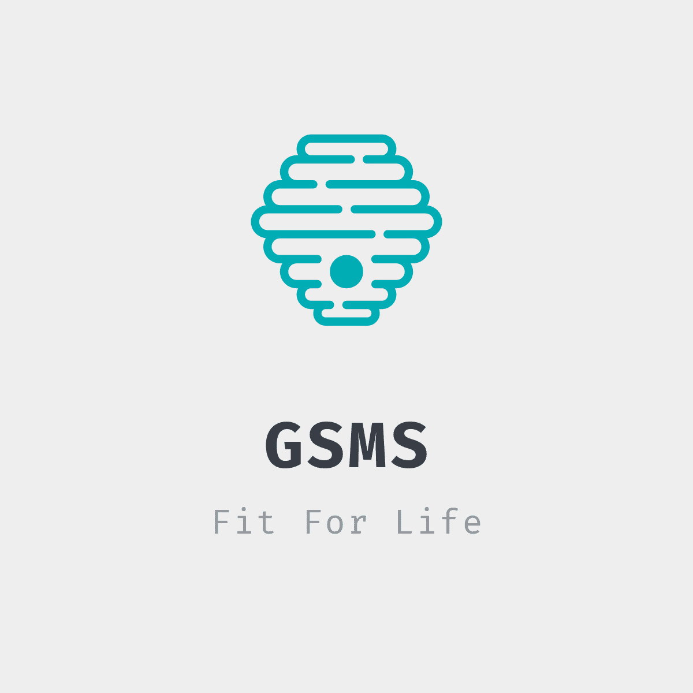

# Welcome to GSMS FitnessApp

## Features
  * Connects the client with their nutritionist.
  * Educate clients about difference exercises and amount of time they are required to give to their body parts
  * Lets you calculate your BMR and report it to the nutritionist. 
  * Completely ad-free.
  * Supports Android 6.0 and above.
## Development
For development Android Studio, with gradle is used.
